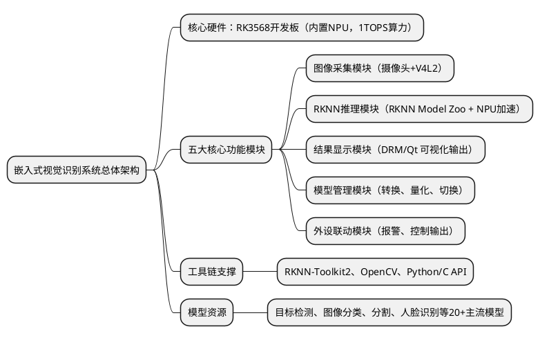
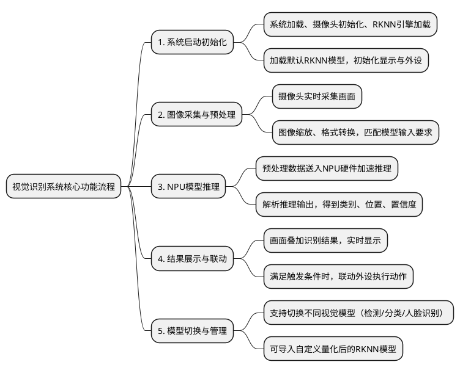

# RK3568 项目说明图片完整 OCR 提取（含代码块）

整理时间：2026-06-24  
输出目的：补齐上一版只做“要点总结”造成的信息遗漏，将图片中的正文、命令、C 代码、PlantUML 代码块一起整理保存。

说明：
- 本文按图片和已有 OCR 文本重新整理，代码块单独保留。
- 原图中部分代码截图字号很小，无法确认的个别注释或版本号已按上下文标注“按实际文件名替换”。
- 原目录下已有分文件仍保留：`说明.txt`、`设备信息.txt`、`编译相关.txt`、`通信相关.txt`、`验收标准.txt`、`显示BMP/教程.txt`。

---

## 1. 项目说明与目标（来自 wechat_longscreenshot_2026-06-24_154710_516.png）

### 一、项目背景与开发目的

随着边缘 AI 与智能视觉技术的快速落地，端侧图像识别、目标检测已成为安防、工业、消费电子等领域的核心应用。传统 AI 教学多侧重云端算法训练，嵌入式教学多侧重硬件开发，二者长期脱节，学习者难以掌握“算法模型 - 硬件加速 - 端侧落地”的完整开发链路，无法满足企业对嵌入式 AI 人才的需求。

本项目以瑞芯微 RK3568 嵌入式 AI 芯片为核心载体，依托官方 RKNN Model Zoo 预优化模型仓库，打造一套从模型转换、NPU 加速推理到场景落地的完整视觉识别系统。项目摒弃纯理论的书本式教学，以动手实操为核心，让学习者在真实硬件上跑通目标检测、图像分类、人脸识别等主流视觉任务，吃透端侧 AI 部署的核心逻辑。

项目适配人工智能、嵌入式、计算机视觉、物联网等相关专业的课程实训、课程设计，也适合嵌入式 AI 爱好者入门实践。无需深厚的算法训练基础，跟随步骤即可从零搭建出可实时运行的视觉识别系统，既能夯实嵌入式 Linux 开发功底，又能掌握 NPU 加速推理、模型量化部署的核心技能，为后续对接边缘 AI 岗位、参与学科竞赛筑牢基础。

### 二、项目建设目标与教学导向

全程以“项目 + 能力”为导向，重点培养 5 种实用能力：

- **技术整合能力**：从头到尾掌握“图像采集 -> 预处理 -> 模型转换 -> NPU 推理 -> 结果输出”的完整端侧 AI 流程。
- **系统协同能力**：学会摄像头驱动、RKNN 推理引擎、界面显示、外设联动等多个模块的配合开发。
- **工程实践能力**：搞懂 RK3568 开发板 + NPU 硬件加速 + RKNN 工具链协同工作的逻辑，掌握从环境搭建、模型量化到端侧部署调试的全流程。
- **创新应用能力**：基于 RKNN Model Zoo 拓展人脸识别、工业质检、行为分析等场景。
- **问题分析与解决能力**：遇到模型精度损失、推理卡顿、硬件适配异常等问题时，能够主动分析、排查和解决。

### 三、系统架构与技术实现

#### （一）总体系统结构图



#### （二）核心技术模块说明

| 模块 | 技术说明 |
|---|---|
| 核心主控模块 | 以 RK3568 为核心，内置 NPU 神经网络处理器，INT8 量化下最高 1TOPS 算力，用于加速 AI 模型推理。 |
| 图像采集模块 | 通过 USB/MIPI 摄像头采集实时画面，基于 V4L2 获取图像数据，完成尺寸缩放、格式转换等预处理。 |
| RKNN 推理模块 | 依托官方 RKNN Model Zoo 模型仓库，内置 20+ 经过硬件优化的主流视觉模型，可直接调用 NPU 推理。 |
| 模型转换与量化模块 | 配套 RKNN-Toolkit2，可将 PyTorch、TensorFlow 等模型转换为 RKNN 格式，支持 INT8 量化。 |
| 结果显示模块 | 基于 Linux DRM 或 Qt 框架，在屏幕上实时展示采集画面，叠加检测框、类别、置信度等识别结果。 |
| 外设联动模块 | 可对接继电器、蜂鸣器、指示灯等，根据识别结果触发报警、开关控制等动作。 |

### 四、功能流程与核心逻辑



#### （一）系统启动与初始化流程

系统上电后，Linux 系统启动，依次完成摄像头设备、显示驱动、RKNN 推理引擎初始化；从 RKNN Model Zoo 中加载默认模型（如 YOLO 目标检测），完成模型内存分配与 NPU 资源绑定；硬件自检完成后进入正常运行状态，实时采集画面并执行推理。

#### （二）图像采集与预处理流程

摄像头按设定帧率采集原始图像数据，通过 V4L2 框架传递给主控；系统对图像进行尺寸缩放、通道格式转换、归一化等预处理，匹配模型输入尺寸与数据格式要求，处理完成后送入 NPU 推理引擎。

#### （三）NPU 加速推理流程

预处理后的图像数据送入 RKNN 推理引擎，由 RK3568 内置 NPU 执行硬件加速计算；推理完成后解析输出结果，得到目标类别、位置坐标、置信度等信息，并进行非极大值抑制等后处理，得到最终识别结果。

#### （四）结果展示与外设联动流程

识别结果叠加在原始画面上，包括检测框、类别名称、置信度数值，通过显示屏实时输出；可配置触发规则，当检测到指定目标或异常状态时，自动触发蜂鸣器报警、继电器开关等外设动作。

#### （五）模型切换与管理流程

系统支持在 RKNN Model Zoo 模型库中灵活切换目标检测、图像分类、人脸识别、语义分割等模型；也支持导入用户自定义量化后的 RKNN 模型，适配特定场景。

### 五、实训任务设计与教学价值

| 阶段 | 实训内容 |
|---|---|
| 基础阶段 | 搭建 RK3568 开发环境，熟悉 Linux 操作；跑通 RKNN Model Zoo 官方图像分类 Demo，实现静态图片推理。 |
| 模块阶段 | 分模块调试摄像头实时采集、RKNN-Toolkit2 模型转换与 INT8 量化、单模型实时视频推理。 |
| 系统整合阶段 | 整合图像采集、NPU 推理、结果显示，实现实时目标检测；添加多模型切换功能。 |
| 优化拓展阶段 | 优化推理速度与识别精度；拓展人脸识别、语义分割、外设联动、数据上传云端等功能。 |

教学成果形式：

- **实物成果**：可独立运行的嵌入式视觉识别终端。
- **代码成果**：完整项目源码、模型转换脚本、量化配置文件。
- **文档成果**：项目开发说明书、实训报告、答辩 PPT 模板。
- **演示成果**：功能演示视频，展示实时推理、模型切换、外设联动等功能。

### 六、系统优势与教学前瞻性

| 优势维度 | 具体表现 |
|---|---|
| 趣味性强 | 能实时看到目标被识别和框选，效果直观。 |
| 综合性高 | 覆盖嵌入式 Linux、图像采集、AI 模型部署、NPU 加速、显示交互等知识点。 |
| 门槛友好 | 依托 RKNN Model Zoo 现成模型，不用从零训练算法。 |
| 实用性足 | 可迁移到智能安防、工业质检、智能家居等真实产品开发。 |
| 拓展性广 | 后续可拓展 OCR、姿态估计、多模态模型等功能。 |
| 教学适配 | 可对接《嵌入式 AI》《计算机视觉》《边缘计算》《嵌入式操作系统》等课程。 |

### 七、部署条件与支持资源

硬件平台：

- RK3568 开发板（内置 NPU，标配 Linux 系统）。
- USB 摄像头 / MIPI 摄像头。
- HDMI 显示屏 / LCD 触摸屏。
- 蜂鸣器、继电器模块、电源适配器、杜邦线等。

系统与开发工具：

- Linux（Ubuntu/Debian，开发板官方固件）。
- RKNN-Toolkit2、RKNN Runtime、OpenCV、GCC/Makefile、Python3。
- RKNN Model Zoo 官方模型库。

配套教学资源：

- 完整源码工程包。
- 实训指导手册。
- 教学课件与视频。
- 实训报告模板、答辩 PPT 模板。

部署方式：

- 单人实训。
- 小组实训。
- 竞赛拓展。

### 八、成果案例与应用场景

- 高校教学。
- 兴趣实践。
- 竞赛孵化。
- 小型落地，例如安防监测、工业质检、门禁人脸识别等。

### 九、总结与合作建议

本项目以端侧 AI 落地为核心场景，依托 RKNN Model Zoo，融合图像采集、NPU 加速推理、模型量化部署、人机交互等技术，是一套新手友好、实战性强、拓展空间充足的实训方案。

### 目标 / 验收点

1. 界面设计：LCD 屏幕，显示图标（BMP，扩展 JPG、PNG），20 分。
2. 人机交互：触摸屏，获取坐标，判断范围，扩展滑屏，20 分。
3. 摄像头数据采集：打开、抓拍、关闭，扩展录制，20 分。
4. 视觉识别：推理模型部署 / 使用训练模型文件，实现种类区分，扩展数据标注，20 分。

---

## 2. 设备信息（来自 设备信息.txt）

### 一、设备清单

在开始使用 RK3568 开发板之前，需要准备必要设备和配件。

#### （一）RK3568 开发板

RK3568 开发板是基于 Rockchip RK3568 SoC 的嵌入式开发平台。RK3568 采用四核 ARM Cortex-A55 64 位架构，集成 Mali-G52 GPU，并内置视频编解码器（VPU）、显示控制器及多种高速外设接口，兼顾性能、功耗与系统集成度。

该平台支持 H.264/H.265 等格式的 4K 硬件视频编解码，提供 HDMI、MIPI-DSI、MIPI-CSI、USB、PCIe、Gigabit Ethernet 等接口，可连接显示屏、摄像头、存储设备及网络外设。

#### （二）电源适配器

电源适配器为 RK3568 开发板提供稳定输入电源。需要确保输出电压、最大输出电流及功率容量满足开发板和外设整体功耗。供电不足会导致系统启动失败、运行不稳定、USB 外设掉线、存储异常或系统重启等问题。

#### （三）USB 转 Type-C 线

USB 转 Type-C 串口线通常内置 USB-to-UART 转换芯片（如 CH340、CP2102、FT232），用于 Bootlog 查看、串口控制台、固件烧录、Bootloader 调试等。Type-C 只表示物理接口形态，不等同于 UART 协议。

#### （四）烧写线

烧写线用于建立 PC 与开发板之间的下载或调试连接，将 Bootloader、固件、系统镜像或应用程序写入 eMMC、NAND Flash、NOR Flash 或 SD 卡。常见方式包括 USB 下载、UART 下载、JTAG/SWD 调试烧录等。

#### （五）网线

网线用于开发板连接交换机、路由器或 PC，实现有线网络通信。通过网线可进行 SSH 登录、文件传输、NFS 挂载、网络调试、云服务访问等。建议使用 Cat5e 或以上规格网线。

#### （六）泡沫

泡沫主要用于运输、包装与存储保护。建议使用防静电泡棉，减少 ESD 风险。实际开发中建议使用防静电工作垫、绝缘支架或固定底座，不建议长期直接放在普通泡沫表面。

---

## 3. 交叉编译与程序运行（来自 wechat_longscreenshot_2026-06-24_154824_146.png）

图片顶部说明：

> 交叉编译 RK3568 程序：编写 C/C++ 代码，用 aarch64-linux-gnu-gcc 编译生成 main 文件，上传至开发板后执行 chmod +x 赋予权限，最后用 ./main 运行。若被 UI 遮挡，可用 killall -9 rk356x-demo 关闭。

### 一、编写代码

在编写嵌入式代码时，需要注意重要规范，这不仅有助于程序可读性和可维护性，也能避免编译和运行过程中的常见错误。

1. 文件类型
   - 源代码：C 语言使用 `.c`，C++ 语言使用 `.cpp`。
   - 头文件：C 使用 `.h`，C++ 使用 `.hpp`。
   - 库文件 / 应用程序扩展：使用 `.a`、`.so`、`.dll` 等适合目标平台的格式。

2. 代码编写格式
   - 命名规范：遵循一致命名约定，如变量名、函数名使用驼峰命名或下划线分隔。
   - 缩进与注释：保持良好缩进，使用清晰注释说明代码逻辑。
   - 字符编码：源文件使用 UTF-8 编码，避免全角字符。

3. 文件格式
   - 保存格式：代码文件建议使用纯文本格式。
   - 换行符：Linux 用 LF，Windows 用 CRLF，需要注意兼容。

### 二、编译程序

使用开发板编译器 `aarch64-linux-gnu-gcc` 将源代码文件 `main.c` 生成程序文件 `main`。

```bash
aarch64-linux-gcc main.c -o main
```

编译成功后，将生成 `main` 程序文件。接下来将该文件上传到开发板。可以使用 MobaXterm、SCP 工具，或通过拖拽文件至板端文件目录来完成上传。

### 三、赋予权限

Linux 系统中，默认新生成的文件通常没有执行权限，上传到开发板后需要赋予执行权限：

```bash
# chmod +x 程序文件名字
chmod +x main
```

### 四、运行程序

#### （一）使用相对路径（推荐）

```bash
# 相对路径，使用当前路径拼接程序文件
# ./程序文件名字，"." 代表当前路径
./main
```

`.` 表示当前目录，这是最常见也最推荐的方式。

#### （二）使用绝对路径

```bash
/root/main
```

这里 `/root` 是程序所在目录，可以使用 `pwd` 命令查看当前路径。

有些开发板启动时会自动运行预置 UI 程序（例如名为 `rk356x-demo` 的图形界面），这可能遮挡当前运行程序输出，导致看不到效果。可先用以下命令结束该进程：

```bash
killall -9 rk356x-demo
```

截图附件示例文件：

```text
show_color.c
```

---

## 4. BMP / LCD 基础显示（来自 wechat_longscreenshot_2026-06-24_154930_027.png 与 显示BMP/教程.txt）

### 一、了解硬件特性

LCD 屏幕是帧缓冲设备，设备路径形如 `/dev/fb0` 到 `/dev/fbx-1`，其中 x 表示 LCD 屏幕设备数量。

1. 宽：1024，高：600，像素点 / 尺寸 / 分辨率：1024 * 600。

```c
数据类型 argb_buf[1024*600];
```

2. 位深度（一个像素点所占用的空间大小）：32 位。

```c
// lcd : 32 == 4 字节，1 字节 = 8 位
int argb_buf[1024*600];       // 4 * 1024*600
char argb_buf[4*1024*600];    // 1 * 4*1024*600
```

3. 属性组成（一个像素点的属性组成）：透明度、红、绿、蓝。

```c
// 10 1 0~255
int color = 1242341234;

// 16 1 0~0xff
//      透明度, 红, 绿, 蓝
// 16 4 0~0xff   ff   ff   ff
int blue = 0x000000ff;
int green = 0x0000ff00;
```

### 二、操作硬件

应用工程师使用驱动工程师给到的接口（函数名、参数列表、函数能力）实现硬件操作。

#### 1. 打开文件（open）

```c
// 1. 函数原型
int open(const char *path, int flags);

// int 整型变量一般是 open 的返回值，用于存储 open 打开时的状态；
// 如果是负数则说明打开失败。
// open("即将被打开的文件名字（路径/名称）", 打开时的权限：O_RDWR可读可写；O_RDONLY只读；O_WRONLY只写);

// a. 包含头文件
#include <fcntl.h>

// b.
// b.1. 调用函数打开 lcd 屏幕 "/dev/fb0"
int lcd_fd = open("/dev/fb0", O_RDWR);
if (-1 == lcd_fd) {
    printf("open lcd device failed!\n");
    return -1;
}
```

#### 2. 操作文件（read/write）

```c
// 1. 函数原型
ssize_t read(int fd, void buf[count], size_t count);
// read(已经打开的文件别名，一般是 open 的返回值，
//      从对应打开的文件或设备中读取到的数据放置的缓冲区，
//      缓冲区的大小/数据的数量);

ssize_t write(int fd, void buf[count], size_t count);
// write(已经打开的文件别名，一般是 open 的返回值，
//       即将写入到对应文件中的数据放置的缓冲区，
//       缓冲区的大小/数据的数量);

// a. 包含头文件
#include <unistd.h>

// b. 调用函数
int argb_buf[1024*600];

// 设置颜色 for 遍历

// 写入数据到 lcd 屏幕中
write(lcd_fd, argb_buf, 1024*600*4);

// 从 bmp 图片中读取图像颜色数据
read(bmp_fd, argb_buf, 1024*600*4);
```

#### 3. 关闭文件（close）

```c
// 1. 函数原型
int close(int fd);
// close(已经打开的文件别名，一般是 open 的返回值)

// a. 包含头文件
#include <unistd.h>

// b. 调用函数
close(lcd_fd);
```

### 三、BMP 图片特性

#### （一）BMP 文件简介

BMP（Bitmap）是 Windows 系统中常见的位图图像格式，以结构清晰、颜色数据完整而广泛应用于底层图像处理。在嵌入式显示系统中，BMP 格式因无压缩、解析方便，常用于图像渲染教学与实验项目。

#### （二）BMP 文件结构

BMP 文件结构包含两个主要部分：

- 文件头（54 字节）：注意使用结构体读取图像信息时需要配置为不与内存对齐。
  - BITMAPFILEHEADER（14 字节）：描述文件类型标识 “BM”、文件大小、数据偏移量等。
  - BITMAPINFOHEADER（40 字节）：包含图像宽度、高度、位深度、压缩方式等。
- 颜色数据区：
  - 存储每个像素颜色值，按 B（蓝）、G（绿）、R（红）顺序排列，每个颜色占 1 字节。

读取文件头和颜色数据：

```c
char header[54];
char rgb_buf[1024*600*3];

// ssize_t read(int fd, void buf[.count], size_t count);
// read(已经打开的文件操作符，通常是 open 的返回值，
//      即将要读取到的数据存储位置，存储位置的大小);

read(bmp_fd, header, 54);
read(bmp_fd, rgb_buf, 1024*600*3);
```

#### （三）颜色空间转换

- 位深度：24 位，每个像素占 3 字节。
- 颜色排列顺序：蓝（B）、绿（G）、红（R）。
- 每个颜色分量占 1 字节，范围 0~255。

```c
// lcd : 1024*600*4 字节（屏幕大小）
// bmp : 1024*600*3 字节（图片颜色数据大小）
// 图片大小：宽*高*位深度/8 + 文件头大小
```

BMP 的 24 位 RGB/BGR 数据需要转换为 LCD 的 32 位 ARGB：

```c
// 4100 = 800*5 + 100
// 2000 = 800*2 + 400

int r, g, b, color;

for (j = 0; j < 480; j++) {
    for (i = 0; i < 800; i++) {
        b = rgb_buf[(800*j+i)*3+0];
        g = rgb_buf[(800*j+i)*3+1];
        r = rgb_buf[(800*j+i)*3+2];
        color = r << 16 | g << 8 | b;
        lcd_ptr[800*j+i] = color;
    }
}
```

#### （四）存储方向特性

BMP 图像在垂直方向通常自下而上存储，而 LCD 屏幕通常自上而下显示，因此渲染时要进行垂直翻转。

```c
// lcd 显示方式：从左往右，从上往下
// 0   479
// 1   478
// 2   477
// ....
// n   479-n

// LCD 显示坐标转换公式
lcd_ptr[800 * (480 - 1 - j) + i] = color;
```

### 四、帧缓冲设备

Linux 帧缓冲设备（`/dev/fbX`）提供对显示硬件的统一抽象：

- 设备文件：通常为 `/dev/fb0`。
- 内存映射：通过 `mmap` 将显存映射到用户空间。
- 典型参数：分辨率、色深（16/24/32 位）、像素格式（RGB565/ARGB8888 等）。

### 五、帧缓冲显示 BMP 完整实现

#### （一）帧缓冲初始化流程

```c
// 1. 打开帧缓冲设备
int lcd_fd = open("/dev/fb0", O_RDWR);
if (lcd_fd < 0) {
    perror("Failed to open framebuffer");
    return -1;
}

// 2. 获取屏幕信息
struct fb_var_screeninfo vinfo;
struct fb_fix_screeninfo finfo;

ioctl(lcd_fd, FBIOGET_FSCREENINFO, &finfo);
ioctl(lcd_fd, FBIOGET_VSCREENINFO, &vinfo);

// 3. 计算帧缓冲参数
size_t fb_size = vinfo.xres * vinfo.yres * vinfo.bits_per_pixel / 8;
int line_length = finfo.line_length;

// 4. 内存映射
char *lcd_ptr = mmap(0, fb_size, PROT_READ | PROT_WRITE, MAP_SHARED, lcd_fd, 0);
if (lcd_ptr == MAP_FAILED) {
    perror("Failed to mmap framebuffer");
    close(lcd_fd);
    return -1;
}
```

#### （二）加载并处理 BMP 图片

```c
// 4. 打开 BMP 文件
int bmp_fd = open("image.bmp", O_RDONLY);
if (bmp_fd < 0) {
    perror("Failed to open BMP file");
    // 释放已分配资源...
    return -1;
}

// 5. 读取文件头验证文件格式
char header[54];
if (read(bmp_fd, header, 54) != 54) {
    printf("Invalid BMP file format\n");
    close(bmp_fd);
    // 释放已分配资源...
    return -1;
}

// 6. 读取像素数据
uint8_t rgb_buf[800*480*3];
ssize_t bytes_read = read(bmp_fd, rgb_buf, sizeof(rgb_buf));
if (bytes_read != sizeof(rgb_buf)) {
    printf("Incomplete BMP data\n");
    close(bmp_fd);
    // 释放已分配资源...
    return -1;
}

close(bmp_fd);
```

#### （三）图像数据处理与显示

```c
// 7. 转换并显示图像数据
for (int j = 0; j < 480; j++) {
    for (int i = 0; i < 800; i++) {
        // 获取 BGR 分量
        uint8_t b = rgb_buf[(800*j+i)*3+0];
        uint8_t g = rgb_buf[(800*j+i)*3+1];
        uint8_t r = rgb_buf[(800*j+i)*3+2];

        // 转换为 32 位 ARGB 并考虑垂直翻转
        uint32_t color = 0xFF000000 | (r << 16) | (g << 8) | b;
        lcd_ptr[800*(480-1-j)+i] = color;
    }
}
```

#### （四）资源释放

```c
// 释放帧缓冲资源
munmap(lcd_ptr, fb_size);
close(lcd_fd);
```

### 六、多图像显示

建议将 BMP 显示功能封装为通用函数，支持不同位置和缩放倍数。

```c
void show_bmp(const char *filename, int pos_x, int pos_y, int scale)
{
    // 打开并验证 BMP 文件...
    // 读取图像数据...

    // 显示处理（考虑位置和缩放）
    for (int j = 0; j < height/scale; j++) {
        for (int i = 0; i < width/scale; i++) {
            // 计算原始图像坐标（考虑缩放）
            int src_x = i * scale;
            int src_y = j * scale;

            // 获取像素并转换...
            // 计算 LCD 显示位置
            int lcd_x = pos_x + i;
            int lcd_y = pos_y + j;

            if (lcd_x >= 0 && lcd_x < 800 &&
                lcd_y >= 0 && lcd_y < 480) {
                lcd_ptr[800 * lcd_y + lcd_x] = color;
            }
        }
    }
}
```

多图叠加示例：

```c
// 显示背景（全屏）
show_bmp("background.bmp", 0, 0, 1);

// 显示图标1（右上角）
show_bmp("icon1.bmp", 800-100, 0, 1);

// 显示图标2（右下角）
show_bmp("icon2.bmp", 800-100, 480-100, 1);
```

### 七、交叉编译部署

```bash
arm-none-linux-gnueabi-gcc bmp_display.c -o bmp_display
```

若未配置网络，可通过 USB 或串口方式上传 BMP 图片与可执行文件：

```bash
# U盘
cp /media/usb0/1.bmp .
cp /media/usb0/bmp .

# 串口
rz -y
```

赋予执行权限并运行：

```bash
chmod +x bmp
./bmp
```

练习：准备一张 1024x600 或 800x480 的 24 位 BMP 图片作为项目背景，多加两个 24 位 BMP 界面图标进行显示。

当前项目需要以下图标：

- 打开摄像头。
- 关闭摄像头。
- 抓拍图片。
- 录制视频（可选）。
- 视觉识别。
- 上一张图片。
- 下一张图片。
- 退出图标。

---

## 5. JPEG / JPG 显示与 libjpeg 移植（来自 wechat_longscreenshot_2026-06-24_155012_176.png）

### 一、显示原理

JPEG（Joint Photographic Experts Group）是一种广泛使用的有损压缩图像格式，与未经压缩的 BMP 格式相比具有明显优势。

1. 压缩特性对比
   - BMP 格式：存储完整的未压缩图像数据，可直接显示但占用空间大。
   - JPEG 格式：采用 DCT（离散余弦变换）压缩算法，大幅减小文件体积。

2. 显示流程差异
   - BMP 显示：开发板直接读取像素数据 -> 帧缓冲 -> 显示屏。
   - JPEG 显示：压缩数据 -> libjpeg 解压 -> 原始 RGB 数据 -> 帧缓冲 -> 显示屏。

3. 技术实现要点
   - 使用 libjpeg 开源库实现解压缩算法。
   - 空间换时间策略：解压过程消耗 CPU 资源换取存储空间节省。

### 二、移植流程

生成最终在开发板上要用到的解压缩库（`.a`、`.so`）。

#### 1. 下载并解压源码

访问开源解压缩库官网，下载最新源码包，放置桌面，在桌面空白位置右键打开终端，进入虚拟机，使用以下命令解压：

```bash
wsl  # 进入 WSL 环境（Windows 用户）
tar zxvf jpegsrc.v10.tar.gz -C ~  # 解压到用户目录
```

原图截图里也出现了 `jpegsrc.v9f.tar.gz` 与 `jpeg-9f`，实际操作时按下载到的文件名和解压目录替换。

#### 2. 进入源码目录，配置并编译

```bash
cd ~/jpeg-10  # 进入源码位置，若解压为 jpeg-9f 则改为 cd ~/jpeg-9f
./configure --host=aarch64-linux --prefix=${HOME}/libjpeg  # 配置编译参数
make  # 编译
```

参数说明：

- `configure`：脚本程序。
- `--host`：用于指定编译生成的程序运行的平台。
- `--prefix`：安装位置。

#### 3. 安装解压缩库到虚拟机

```bash
make install-strip
```

将解压缩库安装到 `${HOME}/libjpeg`。

#### 4. 验证是否为所需平台的库

```bash
file ${HOME}/libjpeg/lib/libjpeg.so.10.0.0
```

截图中的验证输出示意为 ARM 平台动态库：

```text
.../libjpeg.so.9.6.0: ELF 32-bit LSB shared object, ARM, EABI5 version 1 (SYSV), dynamically linked, with debug_info, not stripped
```

#### 5. 打包上传开发板

```bash
cd ~/libjpeg
# tar zcvf /mnt/c/用户名/Desktop/libjpeg2arm.tar.gz lib bin
tar zcvf libjpeg2arm.tar.gz lib bin
```

将生成的压缩包上传到开发板中，可选传输方式为 U 盘或网线。如果图形化 Linux 不能正常打开，则需要通过命令行拷贝后再拖拽上传。

```bash
cd ~/libjpeg
cp libjpeg2arm.tar.gz /mnt/c/Users/用户名/Desktop
```

截图中 Windows 用户目录示例：

```bash
cp libjpeg2arm.tar.gz /mnt/c/Users/Administrator/Desktop/
```

#### 6. 在开发板终端解压

以下命令在开发板终端执行：

```bash
gzip -dc libjpeg2arm.tar.gz | tar xvf - -C /
chmod +x /bin/*
```

### 三、代码实现

#### （一）前提准备

```c
#include <stdio.h>
#include "jpeglib.h"
#include "setjmp.h"
```

#### （二）解压实现（参考 example.c）

下面代码块是截图中 libjpeg 示例逻辑的可读部分转录，用于说明如何建立错误处理、创建解压对象、读取头数据、开始解压、逐行读取、释放资源。

```c
// 错误对象收集结构体
struct my_error_mgr {
    struct jpeg_error_mgr pub;  /* "public" fields */

    jmp_buf setjmp_buffer;      /* for return to caller */
};

typedef struct my_error_mgr * my_error_ptr;

/*
 * Here's the routine that will replace the standard error_exit method:
 */
METHODDEF(void)
my_error_exit (j_common_ptr cinfo)
{
    /* cinfo->err really points to a my_error_mgr struct, so coerce pointer */
    my_error_ptr myerr = (my_error_ptr) cinfo->err;

    /* Always display the message. */
    /* We could postpone this until after returning, if we chose. */
    (*cinfo->err->output_message) (cinfo);

    /* Return control to the setjmp point */
    longjmp(myerr->setjmp_buffer, 1);
}

GLOBAL(int)
read_JPEG_file (char * filename)
{
    /*
     * This struct contains the JPEG decompression parameters and pointers to
     * working space (which is allocated as needed by the JPEG library).
     */
    struct jpeg_decompress_struct cinfo;

    /* We use our private extension JPEG error handler. */
    struct my_error_mgr jerr;

    /* More stuff */
    FILE * infile;          /* source file */
    JSAMPARRAY buffer;      /* Output row buffer */
    int row_stride;         /* physical row width in output buffer */

    /*
     * In this example we want to open the input file before doing anything else,
     * so that the setjmp() error recovery below can assume the file is open.
     * VERY IMPORTANT: use "b" option to fopen() if you are on a machine that
     * requires it in order to read binary files.
     */
    if ((infile = fopen(filename, "rb")) == NULL) {
        fprintf(stderr, "can't open %s\n", filename);
        return 0;
    }

    /* Step 1: 分配并初始化解压缩对象 */
    /* We set up the normal JPEG error routines, then override error_exit. */
    cinfo.err = jpeg_std_error(&jerr.pub);
    jerr.pub.error_exit = my_error_exit;

    /* Establish the setjmp return context for my_error_exit to use. */
    if (setjmp(jerr.setjmp_buffer)) {
        /*
         * If we get here, the JPEG code has signaled an error.
         * We need to clean up the JPEG object, close the input file, and return.
         */
        jpeg_destroy_decompress(&cinfo);
        fclose(infile);
        return 0;
    }

    /* Now we can initialize the JPEG decompression object. */
    jpeg_create_decompress(&cinfo);

    /* Step 2: 指定解压缩数据源 */
    jpeg_stdio_src(&cinfo, infile);

    /* Step 3: 读取文件头数据 */
    (void) jpeg_read_header(&cinfo, TRUE);

    /*
     * Step 4: 设置解压参数，可以直接使用默认的解压缩参数
     *
     * In this example, we don't need to change any of the defaults set by
     * jpeg_read_header(), so we do nothing here.
     */

    // unsigned int scale_num, scale_denom; /* 设定解压缩参数比例 */
    // cinfo.scale_num = 1; cinfo.scale_denom = 1; // 原尺寸
    // cinfo.scale_num = 2; cinfo.scale_denom = 1; // 1/2尺寸（原图注释如此）

    /* Step 5: 开始解压 */
    (void) jpeg_start_decompress(&cinfo);

    /*
     * In this example, we need to make an output work buffer of the right size.
     */
    /* 一行的数据大小 */
    row_stride = cinfo.output_width * cinfo.output_components;

    /* 一行数据的存储缓冲区 */
    buffer = (*cinfo.mem->alloc_sarray)
        ((j_common_ptr) &cinfo, JPOOL_IMAGE, row_stride, 1);

    /* Step 6: 循环读取每一行数据 */
    while (cinfo.output_scanline < cinfo.output_height) {
        (void) jpeg_read_scanlines(&cinfo, buffer, 1);
        /* 此处可将 buffer[0] 写入自己的图像缓冲或显示缓冲 */
    }

    /* Step 7: 解压完成 */
    (void) jpeg_finish_decompress(&cinfo);

    /* Step 8: 释放资源 */
    jpeg_destroy_decompress(&cinfo);

    fclose(infile);

    return 1;
}
```

截图中说明：以上操作只是把原始数据解压出来，项目实际需要将每一行 buffer 数据存入完整图像大小的 `out_buffer` 中。可改为：

```c
GLOBAL(int) read_JPEG_file (char * filename, int *image_width, int *image_height, char **out_buffer)
{
    /* ... 前置初始化同上 ... */

    /* Step 3: 读取文件头数据 */
    (void) jpeg_read_header(&cinfo, TRUE);

    *image_width = cinfo.image_width;
    *image_height = cinfo.image_height;

    row_stride = cinfo.output_width * cinfo.output_components;
    *out_buffer = calloc(1, row_stride * cinfo.image_height);
    char *dst = *out_buffer;

    while (cinfo.output_scanline < cinfo.output_height) {
        (void) jpeg_read_scanlines(&cinfo, buffer, 1);

        // 需要将每行的数据拷贝至整个图像数据缓冲里，在读取每一行时
        memcpy(dst, buffer[0], row_stride);
        dst += row_stride;
    }

    /* ... finish、destroy、close 同上 ... */
    return 1;
}
```

#### （三）缓冲显示

```c
void jpeg_to_lcd(int x, int y, char *jpeg_buffer)
{
    int i, j;

    for (j = 0; j < height; j++)
    {
        for (i = 0; i < width; i++)
        {
            r = jpeg_buffer[(width * j + i) * 3 + 0];
            g = jpeg_buffer[(width * j + i) * 3 + 1];
            b = jpeg_buffer[(width * j + i) * 3 + 2];
            color = r << 16 | g << 8 | b;
            lcd_ptr[800 * (j + y) + i + x] = color;
        }
    }
}
```

接口函数中实现多态调用：

```c
int lcd_draw_jpeg(const char *pathname, int x, int y)
{
    int image_width, image_height;
    char *out_buffer;

    read_JPEG_file(pathname, &image_width, &image_height, &out_buffer);
    // 可以切换多种图片显示特效，利用回调函数进行实现
    rgb_to_lcd(out_buffer, image_width, image_height, x, y);
    free(out_buffer);
}
```

### 四、编译生成程序

```bash
arm-linux-gcc pic.c -o pic -I ~/libjpeg/include -L ~/libjpeg/lib -ljpeg
```

参数说明：

- `-I` 指定头文件所在路径。
- `-L` 指定库文件所在路径。
- `-l` 链接所需使用到的库文件。

### 五、测试效果

上传程序、素材，赋予权限，运行程序：

```bash
mount /dev/sda1 /mnt/udisk
cp /mnt/udisk/1.jpg .
cp /mnt/udisk/pic .
chmod +x pic
./pic
```

后续可实现特效或动态图片：

```c
lcd_draw_jpeg("1.jpg", 0, 0); usleep(1000);
lcd_draw_jpeg("1.jpg", 0, 0); usleep(1000);
lcd_draw_jpeg("1.jpg", 0, 0); usleep(1000);
lcd_draw_jpeg("1.jpg", 0, 0); usleep(1000);
lcd_draw_jpeg("1.jpg", 0, 0); usleep(1000);
lcd_draw_jpeg("1.jpg", 0, 0); usleep(1000);
lcd_draw_jpeg("1.jpg", 0, 0); usleep(1000);
lcd_draw_jpeg("1.jpg", 0, 0); usleep(1000);
lcd_draw_jpeg("1.jpg", 0, 0); usleep(1000);
```

---

## 6. BMP 图片完整显示实现（来自 wechat_longscreenshot_2026-06-24_155034_977.png）

### 一、BMP 图片特性

#### （一）bmp 文件简介

BMP（Bitmap）是 Windows 系统中最常见的位图图像格式，以其结构清晰、颜色数据完整而广泛应用于底层图像处理。在嵌入式显示系统中，BMP 格式因其无压缩、解析方便的特点，常被用于图像渲染的教学或实验项目中。

#### （二）BMP 文件结构

BMP 文件结构包含以下两个主要部分：

- 文件头（54 字节）：注意使用结构体读取图像信息时需要配置为不与内存对齐。
  - BITMAPFILEHEADER（14 字节）：描述文件类型标识（"BM"）、文件大小、数据偏移量等。
  - BITMAPINFOHEADER（40 字节）：包含图像宽度、高度、位深度（通常 24 位）、压缩方式等信息。
- 颜色数据区：
  - 存储每个像素的颜色值，以 B（蓝）、G（绿）、R（红）顺序排列，每个颜色占用 1 字节。

示例代码：读取文件头并加载真正的颜色数据。

```c
char header[54];
char rgb_buf[1024*600*3];

// ssize_t read(int fd, void buf[.count], size_t count);
// read(已经打开的文件的操作符，通常是 open 的返回值，
//      即将要读取到的数据存储位置，存储位置的大小);

read(bmp_fd, header, 54);
read(bmp_fd, rgb_buf, 1024*600*3);
```

#### （三）颜色空间转换

- 位深度：24 位（每个像素占用 3 字节）。
- 颜色排列顺序：蓝（B）、绿（G）、红（R）。
- 每个颜色分量占 1 字节（0-255）。

```c
// lcd : 1024*600*4 字节（屏幕大小）
// bmp : 1024*600*3 字节（图片颜色数据大小）
// 图片大小：宽*高*位深度/8 + 文件头的大小
```

由于 LCD 常使用 32 位 ARGB 格式，而 BMP 为 24 位 RGB，因此需要进行颜色格式转换：

```c
// 4100 = 800*5 + 100
// 2000 = 800*2 + 400

int r, g, b, color;

for (j = 0; j < 480; j++) {
    for (i = 0; i < 800; i++) {
        b = rgb_buf[(800*j+i)*3+0];
        g = rgb_buf[(800*j+i)*3+1];
        r = rgb_buf[(800*j+i)*3+2];
        color = r << 16 | g << 8 | b;
        lcd_ptr[800*j+i] = color;
    }
}
```

#### （四）存储方向特性

BMP 图像在垂直方向上的存储顺序是自下而上，而 LCD 屏幕通常采用自上而下的显示逻辑，因此需要在图像渲染时进行垂直翻转。

```c
// lcd 显示方式：从左往右，从上往下
// 0   599
// 1   598
// 2   597
// .....
// j   599-j

// LCD显示坐标转换公式
lcd_ptr[1024 * (600 - 1 - j) + i] = color;
```

思考：`600-1` 指的是图片的高还是 LCD 屏幕的高？答案要根据当前参与转换的图像高度与屏幕显示区域确定。

### 二、指定位置显示固定大小图片

需要传入：

- 指定位置：显示起点 `int x, int y`。
- 固定大小：图片尺寸 `int w, int h`。
- 图片名称：`const char *pathname`。

#### 1. 函数声明

```c
int lcd_draw_bmp(const char *pathname, int x, int y, int w, int h);
```

#### 2. 函数实现（截图可读部分）

```c
#include <sys/mman.h>
#include <fcntl.h>
#include <unistd.h>
#include <stdio.h>

int lcd_fd;
int *lcd_ptr;

int lcd_draw_bmp(const char *pathname, int x, int y, int w, int h)
{
    // 1. 打开图片文件 1.bmp
    int bmp_fd = open(pathname, O_RDWR);
    if (-1 == bmp_fd)
    {
        printf("open bmp file failed!\n");
        return -1;
    }

    // 2. 操作文件
    char header[54];
    read(bmp_fd, header, 54);

    char rgb_buf[w*h*3];
    read(bmp_fd, rgb_buf, w*h*3);

    int i, j;
    int r, g, b, color;

    for (j = 0; j < h; j++)
    {
        for (i = 0; i < w; i++)
        {
            b = rgb_buf[(w*j+i)*3+0];
            g = rgb_buf[(w*j+i)*3+1];
            r = rgb_buf[(w*j+i)*3+2];
            color = r << 16 | g << 8 | b;

            lcd_ptr[1024 * (y + h - 1 - j) + x + i] = color;
        }
    }

    close(bmp_fd);
    return 0;
}
```

#### 3. 函数调用

函数既可以作为入口函数使用，也可以被其他函数调用：

```c
int main(void)
{
    dev_init();

    // const char *pathname = "1.bmp";
    lcd_draw_bmp("1.bmp", 0, 0, 1024, 600);

    // const char *pathname = "2.bmp";
    lcd_draw_bmp("2.bmp", 0, 0, 200, 200);
    lcd_draw_bmp("3.bmp", 200, 200, 100, 100);

    dev_uninit();

    return 0;
}
```

终端设备上显示 gif：

1. 在搜索引擎查找 gif，然后使用分解器分解为一张张静态图片。
2. 在代码中显示每张图片之后，使用延时函数进行延时。

```c
// 显示的第一张
lcd_draw_bmp("1.bmp", 0, 0, 1024, 600);
usleep(1000000);  // 1 秒 = 1000毫秒 = 1000000微秒
lcd_draw_bmp("2.bmp", 0, 0, 1024, 600);
// ... 后续逻辑类似，可以参考如上代码
```

### 三、帧缓冲设备

Linux 帧缓冲设备（`/dev/fbX`）提供对显示硬件的统一抽象：

- 设备文件：通常为 `/dev/fb0`。
- 内存映射：通过 `mmap` 将显存映射到用户空间。
- 典型参数：分辨率、色深（16/24/32 位）、像素格式（RGB565/ARGB8888 等）。

#### （一）帧缓冲初始化流程

```c
// 1. 打开帧缓冲设备
int lcd_fd = open("/dev/fb0", O_RDWR);
if (lcd_fd < 0) {
    perror("Failed to open framebuffer");
    return -1;
}

// 2. 获取屏幕信息
struct fb_var_screeninfo vinfo;
struct fb_fix_screeninfo finfo;

ioctl(lcd_fd, FBIOGET_FSCREENINFO, &finfo);
ioctl(lcd_fd, FBIOGET_VSCREENINFO, &vinfo);

// 3. 计算帧缓冲参数
size_t fb_size = vinfo.xres * vinfo.yres * vinfo.bits_per_pixel / 8;
int line_length = finfo.line_length;

// 4. 内存映射
char *lcd_ptr = mmap(0, fb_size, PROT_READ | PROT_WRITE, MAP_SHARED, lcd_fd, 0);
if (lcd_ptr == MAP_FAILED) {
    perror("Failed to mmap framebuffer");
    close(lcd_fd);
    return -1;
}
```

#### （二）加载并处理 BMP 图片

```c
// 4. 打开BMP文件
int bmp_fd = open("image.bmp", O_RDONLY);
if (bmp_fd < 0) {
    perror("Failed to open BMP file");
    // 释放已分配资源...
    return -1;
}

// 5. 读取文件头验证文件格式
char header[54];
if (read(bmp_fd, header, 54) != 54) {
    printf("Invalid BMP file format\n");
    close(bmp_fd);
    // 释放已分配资源...
    return -1;
}

// 6. 读取像素数据
uint8_t rgb_buf[800*480*3];
ssize_t bytes_read = read(bmp_fd, rgb_buf, sizeof(rgb_buf));
if (bytes_read != sizeof(rgb_buf)) {
    printf("Incomplete BMP data\n");
    close(bmp_fd);
    // 释放已分配资源...
    return -1;
}

close(bmp_fd);
```

#### （三）图像数据处理与显示

```c
// 7. 转换并显示图像数据
for (int j = 0; j < 480; j++) {
    for (int i = 0; i < 800; i++) {
        // 获取BGR分量
        uint8_t b = rgb_buf[(800*j+i)*3+0];
        uint8_t g = rgb_buf[(800*j+i)*3+1];
        uint8_t r = rgb_buf[(800*j+i)*3+2];

        // 转换为32位ARGB并考虑垂直翻转
        uint32_t color = 0xFF000000 | (r << 16) | (g << 8) | b;
        lcd_ptr[800*(480-1-j)+i] = color;
    }
}
```

#### （四）资源释放

```c
// 释放帧缓冲资源
munmap(lcd_ptr, fb_size);
close(lcd_fd);
```

### 四、多图像显示

```c
void show_bmp(const char *filename, int pos_x, int pos_y, int scale)
{
    // 打开并验证BMP文件...
    // 读取图像数据...

    // 显示处理（考虑位置和缩放）
    for (int j = 0; j < height/scale; j++) {
        for (int i = 0; i < width/scale; i++) {
            // 计算原始图像坐标（考虑缩放）
            int src_x = i * scale;
            int src_y = j * scale;

            // 获取像素并转换...
            // 计算LCD显示位置
            int lcd_x = pos_x + i;
            int lcd_y = pos_y + j;

            if (lcd_x >= 0 && lcd_x < 800 &&
                lcd_y >= 0 && lcd_y < 480) {
                lcd_ptr[800 * lcd_y + lcd_x] = color;
            }
        }
    }
}
```

```c
// 显示背景（全屏）
show_bmp("background.bmp", 0, 0, 1);

// 显示图标1（右上角）
show_bmp("icon1.bmp", 800-100, 0, 1);

// 显示图标2（右下角）
show_bmp("icon2.bmp", 800-100, 480-100, 1);
```

### 五、交叉编译部署

```bash
arm-none-linux-gnueabi-gcc bmp_display.c -o bmp_display
```

部署与执行：

```bash
# U盘
cp /media/usb0/1.bmp .
cp /media/usb0/bmp .

# 串口
rz -y
```

```bash
chmod +x bmp
./bmp
```

练习：准备一张 1024x600、24 位的 BMP 图片作为项目背景，加多个 24 位 BMP 界面图标进行显示。

当前项目需要以下图标：

打开摄像头、关闭摄像头、抓拍图片、录制视频（可选）、视觉识别、上一张图片、下一张图片、退出图标。

---

## 7. 当前编译与发布流程（来自 编译相关.txt）

### 1. 云服务器交叉编译

在 RK 工程目录执行：

```bash
./scripts/build_in_docker.sh
```

脚本会使用 Docker 内的 Ubuntu 22.04 安装 aarch64 交叉编译器，并生成静态链接的 ARM64 程序：

- `output/lcd_demo`
- `output/touch_test`
- `output/camera_capture`
- `output/vision_panel`

### 2. 发布到云服务器静态目录

```bash
./scripts/publish_static.sh
```

发布后板子可通过下面地址下载：

- `http://8.129.31.210/rk/lcd_demo`
- `http://8.129.31.210/rk/touch_test`
- `http://8.129.31.210/rk/camera_capture`
- `http://8.129.31.210/rk/vision_panel`

### 3. 通过桥接让板子下载运行

```bash
./scripts/bridge_command.py 'cd /userdata/vision/bin && wget -O lcd_demo http://8.129.31.210/rk/lcd_demo && chmod +x lcd_demo && ./lcd_demo split'
```

相机优先用短探测命令，不要直接长时间采集：

```bash
./scripts/bridge_command.py 'cd /userdata/vision/bin && wget -O camera_capture http://8.129.31.210/rk/camera_capture && chmod +x camera_capture && ./camera_capture --probe /dev/video-camera0'
```

综合 LCD + 触摸演示：

```bash
./scripts/bridge_command.py 'cd /userdata/vision/bin && wget -O vision_panel http://8.129.31.210/rk/vision_panel && chmod +x vision_panel && ./vision_panel --seconds 10 /dev/input/event6'
```

### 4. 当前注意事项

- 板端是 Buildroot，不要假设有 `gcc/cmake/make`。
- BusyBox 的 `hostname` 不支持 `hostname -I`，用 `hostname -i`。
- 目前主通道是云服务器桥接，不依赖 Windows 中转。
- 如果桥接心跳离线，先确认板子网络 / 电源 / 自启客户端，再下发任务。

---

## 8. 通信相关（来自 通信相关.txt）

当前状态：

1. RK3568 板子已联网，IP 是 `192.168.1.21`，SSH 可登录，root 密码已改过，不要改动现有登录方式。
2. 板子已经和云服务器建立通信桥，不需要 Windows 参与中转。
3. 云服务器上的桥接服务已运行：
   - 服务脚本：`/root/board_bridge_server.py`
   - 本地监听：`127.0.0.1:19090`
   - 公网入口：`/bridge`
   - nginx 已把 `/bridge` 代理到 `127.0.0.1:19090`
4. 板子上的常驻客户端已装好：
   - 脚本：`/tmp/board_bridge_client.py`
   - 自启脚本：`/etc/init.d/S90board_bridge`
   - 开机后会自动启动，持续向云服务器发心跳并轮询任务。
5. 板子已经能向云服务器上报心跳，云端状态里能看到 RK356X。

通信方式：

板子 -> 云服务器：

- `POST /bridge/heartbeat` 上报心跳。
- `GET /bridge/task?board_id=xxx` 拉取任务。
- `POST /bridge/report` 回传任务结果。

云服务器 -> 板子：

- `POST /bridge/command` 下发命令到任务队列。

使用方式：

```text
http://8.129.31.210/bridge/status
```

下发命令示例：

```http
POST http://8.129.31.210/bridge/command
```

```json
{"board_id":"*","task_id":"demo-001","cmd":"echo hello && uname -a && hostname -i"}
```

约束：

- 板子是 Buildroot 系统，不要假设有 gcc/cmake/make。
- 板子上尽量只用 BusyBox + python3 + 现有脚本。
- 需要编译 RK3568 程序时，优先在云服务器用交叉编译器 `aarch64-linux-gnu-gcc` 编译，再用 scp 发到板子。
- BusyBox 的 hostname 不支持 `hostname -I`，要用 `hostname -i` 或 `ip addr`。

接下来要做：

1. 继续稳定桥接服务，保证板子重启后自动连上。
2. 项目开发优先走“云服务器交叉编译 -> scp 到板子运行”的流程。
3. 不要再依赖 Windows 中转。

---

## 9. 验收标准（来自 验收标准.txt）

1. 界面设计：LCD 屏幕，显示图标（BMP，扩展 JPG、PNG），20 分。
2. 人机交互：触摸屏，获取坐标，判断范围，扩展滑屏，20 分。
3. 摄像头数据采集：打开、抓拍、关闭，扩展录制，20 分。
4. 视觉识别：推理模型部署 / 使用训练模型文件，实现种类区分，扩展数据标注，20 分。

---

## 10. 防遗漏检查清单

本文件已补入上一版遗漏的代码类信息：

- PlantUML 架构图代码块。
- PlantUML 功能流程代码块。
- 交叉编译 `aarch64-linux-gcc main.c -o main`。
- 赋权与运行 `chmod +x main`、`./main`、`/root/main`。
- 关闭默认 UI `killall -9 rk356x-demo`。
- LCD `/dev/fb0` 打开、read/write、close 示例。
- BMP 文件头、RGB 数据读取、BGR 转 ARGB、垂直翻转。
- FrameBuffer `ioctl`、`mmap`、`munmap` 流程。
- `show_bmp` 多图显示封装。
- `lcd_draw_bmp` 指定位置显示函数。
- libjpeg 移植命令：解压、configure、make、install、file、tar、复制、板端解压。
- JPEG 解码示例：错误处理结构、`read_JPEG_file`、`jpeg_start_decompress`、`jpeg_read_scanlines`。
- JPEG 缓冲显示、`lcd_draw_jpeg` 调用、编译链接 `-ljpeg`。
- 测试命令：挂载 U 盘、复制图片和程序、赋权运行。

